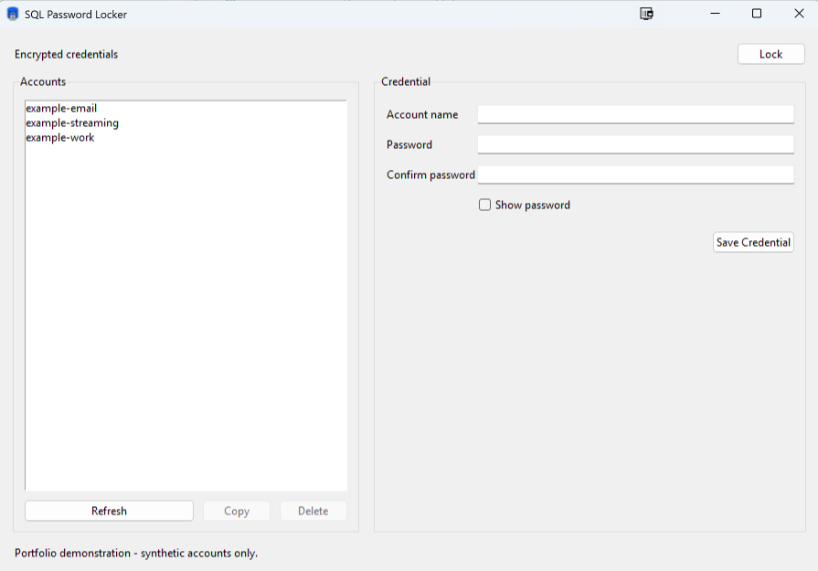

# SQL Password Locker

SQL Password Locker is a secure SQL Server-backed Python password vault for Windows. It
encrypts credential passwords in the application before persistence, keeps SQL operations
parameterized, and provides both an operational command-line interface and a responsive
Tkinter desktop interface.

This is a portfolio project with defense-in-depth controls and automated tests. It has not
received a professional security audit; review [SECURITY.md](SECURITY.md) before relying on it
for sensitive data.

## Architecture

- The CLI and Tkinter GUI share the same runtime composition, service, cryptographic, schema,
  and repository layers.
- `VaultService` coordinates lock state, encryption, and encrypted persistence without
  accepting plaintext records at the repository boundary.
- The SQL Server repository opens short-lived, transactional `pyodbc` connections, uses fixed
  table identifiers and parameter placeholders, and closes cursors and connections after each
  operation.
- The schema manager applies the packaged version-1 migration transactionally and rejects
  partial or unsupported schema states.
- Production integrations are loaded lazily. Importing the package does not open configuration
  files, connect to SQL Server, access the clipboard, or create a GUI window.

## Encryption model

Creating a vault generates a random 256-bit data-encryption key. Argon2id derives a 256-bit
wrapping key from the master password and a random salt; the current new-vault profile uses
65,536 KiB of memory, three iterations, and four lanes. AES-256-GCM wraps the data key and
independently encrypts every credential password with a fresh 96-bit nonce. Versioned,
canonical associated data binds ciphertext to the application, vault, format, and normalized
account name.

The master password and plaintext data key are not stored in SQL Server. SQL Server does store
the Argon2id parameters and salt, the wrapped data key, authenticated-encryption fields,
normalized account names, timestamps, and revisions. Account names are metadata and remain
visible to database readers even though credential passwords are encrypted.

## SQL persistence and transport

The initial migration creates three tables in `dbo`: a schema-version singleton, vault
metadata, and encrypted credentials. A database must already exist, and the configured identity
must be able to create these tables when `init` first runs and then read and modify their rows.

Every production connection forces `Encrypt=Yes` and `TrustServerCertificate=No`. The
application rejects attempts to weaken those settings, so SQL Server must present a certificate
that ODBC Driver 18 can validate for the configured server name.

## Prerequisites

- Windows with Python 3.10 through 3.13 and Tkinter
- Microsoft SQL Server with an existing empty database for the vault
- Microsoft ODBC Driver 18 for SQL Server
- A trusted SQL Server TLS certificate whose name matches the configured server
- Either Windows integrated authentication or a dedicated SQL login with only the required
  database permissions

## Installation

From a PowerShell prompt in a source checkout:

```powershell
py -3.13 -m venv .venv
.\.venv\Scripts\python.exe -m pip install --upgrade pip
.\.venv\Scripts\python.exe -m pip install -e .
```

For development tools, install the bounded optional dependency set instead:

```powershell
.\.venv\Scripts\python.exe -m pip install -e ".[dev]"
```

Installation creates the `pw-locker-sql`, `pwsql`, and `pw-locker-sql-gui` console scripts in
the selected Python environment's `Scripts` directory. Windows can resolve `pwsql` from Win+R
only when that directory is on the invoking user's `PATH`. Cloning the repository merely copies
source files; it neither installs these console scripts nor changes `PATH`.

For regular use, choose a user-scoped or otherwise managed Python installation and expose its
console-script directory through the normal Windows user `PATH` settings. The project
`.venv\Scripts` directory above is a development environment: invoke its executables explicitly
or activate it for a development shell, but do not permanently add that project-specific
directory to `PATH`.

## Configuration

Copy `.env.example` to `.env` and replace its unmistakable placeholders. The default `.env`
file is local-only and ignored by Git. Windows integrated authentication is recommended for
local development when the SQL Server deployment supports it.

The runtime recognizes only these environment or dotenv names:

| Name | Purpose |
| --- | --- |
| `PW_LOCKER_SQL_SERVER` | SQL Server name or instance |
| `PW_LOCKER_SQL_DATABASE` | Existing vault database |
| `PW_LOCKER_SQL_AUTH_MODE` | `integrated` or `sql` |
| `PW_LOCKER_SQL_USERNAME` | Required only for `sql` authentication |
| `PW_LOCKER_SQL_PASSWORD` | Required only for `sql` authentication |
| `PW_LOCKER_SQL_DRIVER` | Optional ODBC driver name; defaults to Driver 18 |
| `PW_LOCKER_SQL_CONNECT_TIMEOUT` | Optional connection timeout from 1 to 120 seconds |

Process environment variables override values from the selected dotenv file. Dotenv
interpolation is disabled. Validate configuration without making a database connection:

```powershell
pw-locker-sql check-config
pw-locker-sql --no-env-file check-config
pw-locker-sql --env-file .env.example check-config
```

The last command demonstrates explicit file selection and validates only the placeholder syntax;
`check-config` never tests SQL connectivity. Never commit a populated configuration file.

By default, configuration loading looks for `.env` in the process's current working directory,
not in the installed package or automatically in the source repository. Win+R may launch the
command with a different working directory, so a repository `.env` is not reliably discovered.
For use outside the repository, define the recognized process/user environment variables and
use `--no-env-file`, or select a protected dotenv file explicitly with `--env-file`. The
configuration option must precede the account name:

```powershell
pwsql --no-env-file "Apple ID"
pwsql --env-file "path\to\vault.env" "Apple ID"
```

The explicit path is supplied at launch and is not stored by the application. These
configuration sources may contain SQL connection settings, including a dedicated SQL login
password when SQL authentication is selected; they must never contain the vault master password
or any stored credential.

## Command-line interface

Passwords are collected through an interactive, non-echoing terminal prompt; they are never
accepted as command-line options.

```powershell
pw-locker-sql init
pw-locker-sql set "example account"
pw-locker-sql list
pw-locker-sql copy "example account"
pw-locker-sql copy "example account" --clear-after 30
pw-locker-sql delete "example account"
pw-locker-sql delete "example account" --yes
```

The standard copy command and its Windows-friendly short alias are:

```powershell
pw-locker-sql copy ACCOUNT
pwsql ACCOUNT

pwsql iTunes
pwsql "Apple ID"
pwsql "Apple ID" --clear-after 30
```

`pwsql` is only a compatibility adapter for `pw-locker-sql copy`: it prompts interactively for
the master password and never displays the retrieved credential. The credential is copied to
the clipboard, and after the requested delay (30 seconds by default) the clipboard is cleared
only if it still contains that same credential. Newer clipboard content is preserved.

`init` applies the version-1 schema and creates one encrypted vault. Copy delays must be between
5 and 300 seconds. The separate SQLite Password Locker uses the `pw` command; SQL Password
Locker uses `pwsql`.

## Desktop GUI

Launch the installed Tkinter entry point:

```powershell
pw-locker-sql-gui
```

The GUI supports vault creation and unlocking, account refresh, credential creation and update,
copy, deletion, and explicit locking. SQL and cryptographic work runs on one bounded background
worker so the Tk event loop remains responsive and concurrent vault operations are rejected. An
unlocked GUI locks after five minutes of inactivity. Copied passwords are conditionally cleared
after 30 seconds.

### GUI preview



## Testing and development

All normal checks are isolated and must keep the opt-in SQL Server integration test disabled:

```powershell
.\.venv\Scripts\python.exe -B -m pytest -q -p no:cacheprovider tests\test_config.py tests\test_packaging.py
.\.venv\Scripts\python.exe -B -m pytest -q -p no:cacheprovider -m "not sqlserver_integration"
.\.venv\Scripts\python.exe -B -m ruff check src tests
.\.venv\Scripts\python.exe -B -m mypy
.\.venv\Scripts\python.exe -m compileall -q src\pw_locker_sql
.\.venv\Scripts\python.exe -B -m pip check
git diff --check
```

The integration boundary requires an explicit command-line opt-in and a separately designated
test database. It is intentionally excluded from local release gates and CI.

## Current limitations

- The application supports one vault and schema version 1; it does not provide upgrades from
  other schemas or import legacy vault formats.
- There is no master-password reset, master-password rotation, data-key rotation, export, or
  built-in recovery workflow. Losing the master password makes stored credentials unrecoverable.
- Backup restore and database rollback can reintroduce older encrypted records or deleted
  metadata; the application does not reconcile divergent backups.
- Normalized account names, timestamps, revisions, encryption parameters, and ciphertext sizes
  remain visible in SQL Server.
- Clipboard clearing is conditional and best-effort. Clipboard managers and other processes may
  retain copied values.
- Python cannot guarantee zeroization of immutable strings or copies held by Python and native
  dependencies. Mutable key buffers are overwritten only on a best-effort basis.
- This project does not replace SQL Server access control, host hardening, monitoring, backups,
  or incident response.

## License

Released under the [MIT License](LICENSE).
